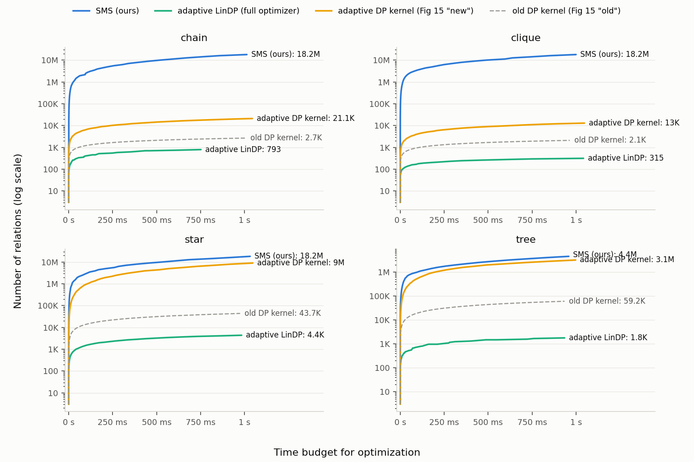

# SMS vs. Adaptive LinDP: join tree construction within a time budget

This directory compares **SMS** (sort + maximal cardinality search), a
linear-time join tree construction algorithm, against the **adaptive LinDP**
join order optimizer implemented in this repository, using the experimental
setup of Fig. 15 of the BTW 2025 paper: for each query shape (chain, clique,
star, tree), *how large a query can each algorithm optimize within a given
time budget?*



## Max relations within a 1 s budget (single-threaded, Apple M-series)

| shape  | SMS (ours) | adaptive LinDP (full) | adaptive DP kernel | old DP kernel | vs LinDP | vs DP kernel |
|--------|-----------:|----------------------:|-------------------:|--------------:|---------:|-------------:|
| chain  | 16.2M      | 793                   | 19.9K              | 2.5K          | ~20,000× | ~800×        |
| clique | 16.2M      | 296                   | 12.2K              | 2.1K          | ~55,000× | ~1,300×      |
| star   | 16.2M      | 4.4K                  | 8M                 | 43.7K         | ~3,700×  | 2.0×         |
| tree   | 4.4M       | 1.8K                  | 3.1M               | 59.2K         | ~2,500×  | 1.4×         |

At the sizes the baseline needs ~1 s for, SMS takes: 2K chain ≈ 0.03 ms,
2K clique ≈ 0.02 ms, 3M star ≈ 105 ms, 1.5M tree ≈ 210 ms.

## The algorithms

**SMS** takes a *hypergraph* (one hyperedge per relation, one vertex per join
attribute) plus relation sizes, and produces a *join tree* for Yannakakis-style
semi-join processing:

1. Sort relations by size (LSD radix sort — linear time; the digit width
   scales with the input so tiny queries don't pay a fixed histogram cost).
2. Run Tarjan & Yannakakis' maximum cardinality search, which is essentially
   Prim's algorithm over the hypergraph, breaking ties toward larger
   relations. Runs in time linear in the hypergraph size.

The parent map produced by MCS *is* the join tree. A validator checks the
join tree property (for every attribute, the relations containing it form a
connected subtree); it passes on all acyclic inputs tested (n = 3 … 20K, all
shapes, 3 size-randomizations each).

**Adaptive LinDP** (this repo) takes a *query graph* (relations, binary join
predicates with selectivities) and produces an optimal *binary join operator
tree* restricted to linearizations: IKKBZ computes one linearization per root,
and an adaptive DP finds the best tree per linearization, sharing work across
linearizations. The "adaptive DP kernel" rows above run a *single* DP pass
over one fixed linearization — that is what Fig. 15 of the paper plots as
"new" / "old" (the full optimizer allocates an n×n table and cannot reach the
figure's star n = 3M).

## Setup notes

- **Same machine, same harness.** Both sides use this repo's query generators
  (`genTestData` in `src/main.cpp`), its repeat-until-stable timing harness
  (`src/Benchmark.cpp`), and its size-growth schedule (grow n geometrically
  until optimization exceeds ~1 s; 3 trials per size with re-randomized
  weights/sizes). The published Fig. 15 numbers come from different hardware,
  so only same-machine ratios are meaningful; the reproduced kernel curves
  match the published shapes.
- **Hypergraph encodings.** Chain/star/tree: one attribute per query graph
  edge, shared by its two relations. Clique: encoded as the intersection
  query R1(x), …, Rn(x) — every pair joined on the same variable, which is
  what a clique query graph means here; the hypergraph is n unary hyperedges
  (α-acyclic, size O(n)). Under the alternative reading (a distinct variable
  per pair) the hypergraph is cyclic and no join tree exists at all, while
  the baseline's input — the query graph — is identical either way.
- **What is timed.** For LinDP: everything after query graph construction.
  For SMS: everything after hypergraph construction, including all working
  memory allocation, the radix sort, and MCS. Relation sizes are uniform in
  [1, 10^6] per trial.
- **Outputs differ.** SMS produces a join tree for semi-join processing;
  LinDP produces a cost-optimal linearized operator tree under its cost
  model. Both solve "plan this join query", but SMS does no cost-based
  join-order search — its guarantee is structural (a valid join tree,
  size-prioritized) and it is the appropriate object for Yannakakis-style
  execution.

## Files

- `bench.cpp` — benchmark driver: C++ port of SMS
  (from `Linear_time_semi_join_planning/sms/{radix_sort,mcs}.py`), the
  hypergraph encodings, the join tree validator, and wrappers around this
  repo's LinDP / DP-kernel implementations.
  Usage: `bench <algo> <shape> [n]` with algo ∈ {sms, sms-verify,
  lindp-new-{none,basic,sorted}, lindp-old-sorted, dp-new, dp-old}.
- `run_all.sh`, `run_dp.sh` — resumable drivers for the full suite.
- `results/*.csv` — raw measurements (`algo,type,n,m,trial,time`).
- `plot.py` — builds `fig15_comparison.png` and the summary table.

Build (no cmake needed):

```
c++ -std=c++2c -O3 -march=native -DNDEBUG -w compare/bench.cpp \
    src/Benchmark.cpp src/BumpAlloc.cpp src/DP.cpp src/LinDP.cpp \
    src/QueryGraph.cpp src/IKKBZ.cpp src/MDQ.cpp src/UnionFind.cpp \
    -o compare/bench
compare/run_all.sh && compare/run_dp.sh && python3 compare/plot.py
```

(Two one-line portability fixes to `src/` — `unsigned __int128` and a missing
`<algorithm>` include — make the repo build with Apple clang.)
